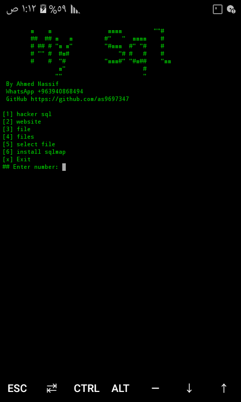

# sqlmap-easy

# install and use



```
git clone https://github.com/as9697347/sqlmap-Easy
cd sqlmap-Easy
bash install.sh
sql
```
# donate
<form action="as9697347@gmail.com" method="post">
   <buten>Click here to donate</buten>
</from>
